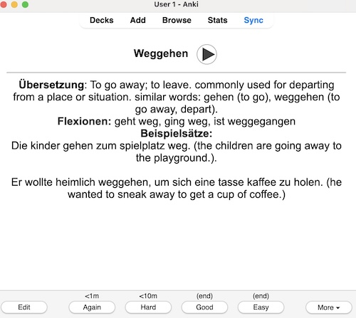

### Create an Anki Card for German Learning

I wanted to create my own [Anki](https://apps.ankiweb.net) deck for learning German. I know that there are existing ones out there, but the point was to create something personalised that contains the words that I often want/try to use. It was also important for me to have the actual pronunciation of the words.

For this, I've used the audio files available at the [Der deutsche Wortschatz](https://www.dwds.de) website. The sample sentences are generated with Gemma 3, downloaded with Ollama. Once a word is generated, I manually upload it to my own deck and sync everything up.

In case one wants to adapt this script to their own needs:

### Installation
1) If not already downloaded, get [uv](https://docs.astral.sh/uv/#installation)
2) You also need to install [Ollama](https://ollama.com) and then download the model: `ollama pull gemma3n:e4b`
3) Run `uv sync`

Once you have that in place, you should be able to generate new cards: 
```
%% uv run main.py
Enter a German word: weggehen        
Done!
```
The output is a .txt file that one can upload to the Anki deck via their app. You should look something like: this:


Note the a complementary English-German card is also created! There's also a small function showing how to run this for more than one word at a time: [generate_multiple_cards.py](./generate_multiple_cards.py).

This is was not "vibe-coded", but it was done fairly quickly, so bugs abound!🐛